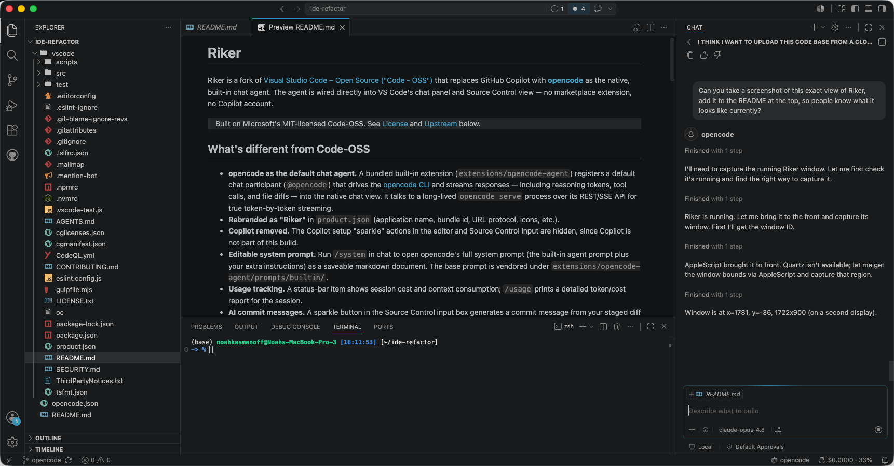

# Riker

Riker is a fork of [Visual Studio Code – Open Source ("Code - OSS")](https://github.com/microsoft/vscode)
that replaces GitHub Copilot with [**opencode**](https://opencode.ai) as the
native, built-in chat agent. The agent is wired directly into VS Code's chat
panel and Source Control view — no marketplace extension, no Copilot account.

<p align="center">
  
</p>

> Built on Microsoft's MIT-licensed Code-OSS. See [License](#license) and
> [Upstream](#upstream-code---oss) below.

## What's different from Code-OSS

- **opencode as the default chat agent.** A bundled built-in extension
  (`extensions/opencode-agent`) registers a default chat participant
  (`@opencode`) that drives the [opencode CLI](https://opencode.ai) and streams
  responses — including reasoning tokens, tool calls, and file diffs — into the
  native chat view. It talks to a long-lived `opencode serve` process over its
  REST/SSE API for true token-by-token streaming.
- **Rebranded as "Riker"** in `product.json` (application name, bundle id, URL
  protocol, icons, etc.).
- **Copilot removed.** The Copilot setup "sparkle" actions in the editor and
  Source Control input are hidden, since Copilot is not part of this build.
- **Editable system prompt.** Run `/system` in chat to open opencode's full
  system prompt (the built-in agent prompt plus your extra instructions) as a
  saveable markdown document. The base prompt is vendored under
  `extensions/opencode-agent/prompts/builtin/`.
- **Usage tracking.** A status-bar item shows session cost and context
  consumption; `/usage` prints a detailed token/cost report for the session.
- **AI commit messages.** A sparkle button in the Source Control input box
  generates a commit message from your staged diff via OpenRouter.
- **Interactive questions.** opencode's `question`/`ask` tool is surfaced as a
  native quick-pick so the agent can ask you to choose between options mid-turn.
- **Attached context.** Anything you attach to a message — an `@file`, a folder,
  a code selection, or a pasted screenshot — is forwarded to opencode directly
  (files/selections inlined, images sent as media) instead of making the agent
  re-discover it.
- **Live task checklist.** When opencode plans multi-step work, its todo list
  renders as a checklist in chat that fills in as steps complete.
- **Command approval.** opencode asks before running shell commands (the command
  is shown in chat first); Allow / Allow for Session / Deny, or set
  `opencode.commandApproval` to `auto` to run without prompting.
- **Checkpoint restore reverts files.** "Restore Checkpoint" rewinds both the
  conversation and the files opencode changed, back to their pre-turn state.
- **Follow-up suggestions.** Each response offers a few one-click next steps
  (review the changes, add tests, implement a plan, …) based on what just
  happened.
- **Ghost-text completions.** Tab-to-accept inline completions from a local
  fill-in-the-middle model server (OpenAI-compatible `/v1/completions` or
  llama.cpp `/infill`). Degrades gracefully — if the server is down, completions
  back off and never block typing. Accept the next word with `Cmd/Ctrl+→`.
  Configure (incl. per-language disabling) under `opencode.inlineCompletions.*`.
- **Editor AI actions.** Right-click **Explain** / **Fix** / **Code Review** (and
  the lightbulb quick-fixes on diagnostics) open the chat panel with the selected
  code inlined and answered by opencode — instead of the stock Copilot funnel.
- **Terminal in the loop.** Copy text from the integrated terminal and **paste it
  into the chat** — a sizable block is registered as a "Pasted text" attachment
  chip (rather than dumped inline) and sent to the agent as context. You can also
  use **Add Terminal Selection to opencode Chat** (right-click menu or
  `Cmd/Ctrl+Alt+L`). The agent's own shell commands stream their output back into
  the chat so you can see the log.
- **Rate-limit awareness.** When a provider rate-limits or overloads, the status
  bar shows a warning with the cool-off countdown instead of failing silently.

### Chat commands

| Command    | Description                                                            |
| ---------- | ---------------------------------------------------------------------- |
| `/plan`    | Run opencode in read-only Plan mode.                                   |
| `/system`  | Edit extra system instructions (`/system <text>` sets, `clear` resets).|
| `/usage`   | Show context, token, and cost usage for the session.                   |

## Prerequisites

1. **opencode CLI** — the agent shells out to it. Install and authenticate:

   ```bash
   # install (see https://opencode.ai for other methods)
   curl -fsSL https://opencode.ai/install | bash

   # log in to a provider (Anthropic, OpenAI, OpenRouter, etc.)
   opencode auth login
   ```

   Riker auto-detects the binary at `~/.opencode/bin/opencode`, Homebrew, or
   `/usr/local/bin`. To point at a custom location, set `OPENCODE_CLI` to its
   absolute path. (A **packaged** Riker app bundles opencode itself — see
   [Packaging a distributable app](#packaging-a-distributable-app-with-opencode-bundled)
   — so this step is only needed for running from source.)

2. **(Optional) `OPENROUTER_API_KEY`** — only needed for the **Generate Commit
   Message** sparkle in Source Control. Export it in the shell you launch Riker
   from (it's the same variable opencode's OpenRouter provider uses):

   ```bash
   export OPENROUTER_API_KEY="sk-or-..."
   ```

3. **Build toolchain** for Code-OSS: Node.js (see `.nvmrc`), Python, and a
   C/C++ compiler. See the upstream
   [How to Contribute](https://github.com/microsoft/vscode/wiki/How-to-Contribute#build-and-run)
   guide for platform-specific build dependencies.

## Build and run from source

```bash
git clone https://github.com/nkasmanoff/riker.git
cd riker

# Use the Node version pinned in .nvmrc
nvm use            # or install that version manually

npm install        # installs dependencies (runs against electron headers)
npm run watch      # incremental compile; leave running in one terminal
```

Then launch the dev build in a second terminal:

```bash
./scripts/code.sh          # macOS / Linux
# .\scripts\code.bat       # Windows
```

This opens the Riker desktop app with the opencode agent already active. Open
the Chat view and start a conversation with `@opencode` (it's the default
participant, so you can also just type).

> First run: make sure you've run `opencode auth login` beforehand, otherwise
> the agent will report an authentication error from the opencode server.

### Settings

Configure under **Settings → Extensions → opencode Agent**, or in
`settings.json`:

| Setting                       | Default           | Purpose                                                                 |
| ----------------------------- | ----------------- | ----------------------------------------------------------------------- |
| `opencode.editApproval`       | `ask`             | `ask` to approve each file edit before it's applied, or `auto` to apply and review after. |
| `opencode.commandApproval`    | `ask`             | `ask` to approve each shell command before it runs, or `auto` to run without prompting.   |
| `opencode.suggestFollowups`   | `true`            | Show suggested follow-up chips under each response.                       |
| `opencode.inlineCompletions.enabled`  | `true`    | Ghost-text inline completions (Tab to accept) from a FIM model server.    |
| `opencode.inlineCompletions.endpoint` | `http://127.0.0.1:8765/v1/completions` | Completion server URL.                          |
| `opencode.inlineCompletions.api`      | `openai`  | Request shape: `openai` (`/v1/completions` + `suffix`) or `llama` (`/infill`). |
| `opencode.inlineCompletions.disabledLanguages` | `[]` | Language ids to disable completions for (e.g. `["markdown"]`).       |
| `opencode.systemPrompt`       | `""`              | Extra instructions appended to opencode's agent prompt every turn.       |
| `opencode.commitMessageModel` | `openrouter/auto` | OpenRouter model slug used by **Generate Commit Message**.               |

## Packaging a distributable app (with opencode bundled)

The steps above run Riker the *dev* way (loose source + `code.sh`). To produce a
real, double-clickable application that ships the opencode CLI inside it — so
end users don't have to install opencode separately — there's a one-command
setup script for macOS.

### One command (macOS)

On any Mac (Apple Silicon or Intel), from a fresh clone:

```bash
./scripts/setup-riker.sh
```

This pins the Node version from `.nvmrc` (via `nvm`), installs dependencies,
vendors the opencode binary, runs the Code-OSS gulp packaging task for the
host architecture, then installs the result to `/Applications` (clearing the
quarantine flag and ad-hoc signing it so it launches locally).

Useful flags:

```bash
./scripts/setup-riker.sh --arch x64     # cross-build the Intel app
./scripts/setup-riker.sh --no-install   # leave the app in ../VSCode-darwin-<arch>/
./scripts/setup-riker.sh --skip-deps    # reuse an existing node_modules
./scripts/setup-riker.sh --skip-build   # just (re)install an already-built app
./scripts/setup-riker.sh --help
```

> Setting up on **another** Mac: run the script there too (it builds natively,
> so there's no quarantine/Gatekeeper prompt). If you instead *copy* a built
> `Riker.app` to a different machine, clear the download flag once with
> `xattr -dr com.apple.quarantine /Applications/Riker.app`.

### Manual steps (any platform)

The script just wraps the standard Code-OSS packaging. To do it by hand — or to
build for Windows/Linux (run those natively on the target OS) — first vendor
the opencode binary into the built-in extension, then run the matching gulp
target:

```bash
# 1. Download the opencode binary for your target into the extension's bin/.
#    Defaults to the host platform/arch and the pinned version (1.17.4).
npm run bundle-opencode
#    Or target another platform / version explicitly:
#    node extensions/opencode-agent/scripts/download-opencode.mjs --platform darwin --arch arm64 --version 1.17.4

# 2. Build the app for your platform/arch (use the matching gulp target):
npm run gulp vscode-darwin-arm64-min      # macOS Apple Silicon
# npm run gulp vscode-darwin-x64-min      # macOS Intel
# npm run gulp vscode-win32-x64-min       # Windows
# npm run gulp vscode-linux-x64-min       # Linux
```

> Important: run `bundle-opencode` **before** the gulp packaging task. The
> built-in `opencode-agent` extension is copied into the app verbatim, so the
> binary must already be present in `extensions/opencode-agent/bin/` when
> packaging runs.

The result is a standalone app next to your checkout, e.g.
`../VSCode-darwin-arm64/Riker.app`, with opencode at
`Riker.app/Contents/Resources/app/extensions/opencode-agent/bin/opencode`.

How resolution works: `extensions/opencode-agent/src/resolveBin.js` prefers, in
order, `OPENCODE_CLI` → the bundled binary → `~/.opencode/bin` → Homebrew →
`/usr/local/bin`. So a packaged build uses its own pinned opencode out of the
box, a source build with nothing bundled falls back to your system install, and
`OPENCODE_CLI` overrides everything.

Notes:

- The opencode binary is ~114 MB per platform and is **git-ignored**
  (`extensions/opencode-agent/bin/`) — it is fetched at build time, never
  committed.
- Bundling ships the CLI, **not credentials**. Users still run
  `opencode auth login` once (or set provider keys); auth lives in
  `~/.config/opencode`, which the bundled binary reads like any other install.
- For a macOS **universal** (`darwin-universal`) build you'd need the binary for
  both arches and to mark it `asarUnpack` / `lipo` it, since a single arm64
  Mach-O won't match across slices. Single-arch builds have no such caveat.
- To distribute outside your own machine you still need to code-sign and
  notarize the app (and the bundled binary), otherwise macOS Gatekeeper blocks
  it. See the upstream `build/azure-pipelines/darwin` pipeline for reference.

## Working with upstream

This fork keeps Microsoft's repository as the `upstream` remote so you can pull
in new VS Code releases:

```bash
git remote -v
# origin    https://github.com/nkasmanoff/riker.git   (your fork)
# upstream  https://github.com/microsoft/vscode.git    (Code-OSS)

git fetch upstream
git merge upstream/main      # resolve conflicts in product.json etc. as needed
```

The opencode integration lives entirely in `extensions/opencode-agent/`, plus
small edits to `product.json` and the two SCM contribution files that hide the
Copilot sparkles — keeping the conflict surface with upstream small.

### Running the extension tests

```bash
node extensions/opencode-agent/test/unit.js
```

## Upstream (Code - OSS)

Riker is built from [microsoft/vscode](https://github.com/microsoft/vscode),
the open-source core of Visual Studio Code. Refer to upstream for the editor
architecture, bundled extensions, dev container, and contribution guidelines.
This fork is **not affiliated with or endorsed by Microsoft.**

## License

Riker is distributed under the [MIT](LICENSE.txt) license, the same license as
Code-OSS.

Copyright (c) Microsoft Corporation. All rights reserved. (Original Code-OSS
code and third-party notices retain their copyright.)
